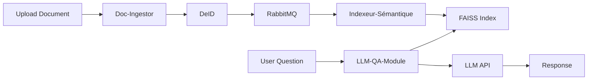

# DocQA-MS - Système d'Assistant Médical Intelligent

> Plateforme microservices d'analyse documentaire médicale basée sur l'IA, permettant l'interrogation en langage naturel de documents cliniques avec support RGPD et désidentification automatique.


## 📋 Table des matières

- [Vue d'ensemble](#-vue-densemble)
- [Architecture](#-architecture)
- [Fonctionnalités](#-fonctionnalités)
- [Prérequis](#-prérequis)
- [Installation](#-installation)
- [Configuration](#-configuration)
- [Utilisation](#-utilisation)
- [API Endpoints](#-api-endpoints)
- [Sécurité](#-sécurité)
- [Dépannage](#-dépannage)

## 🎯 Vue d'ensemble

DocQA-MS est une plateforme complète de gestion et d'analyse intelligente de documents médicaux. Elle combine des technologies de pointe en IA (LLM, RAG, Embeddings) avec une architecture microservices scalable pour offrir :

- 📄 **Ingestion multi-format** : Support PDF, DOCX, TXT, etc.
- 🔍 **Recherche sémantique** : Recherche vectorielle avec FAISS
- 💬 **Q&A en langage naturel** : Interrogation conversationnelle via LLM
- 🛡️ **Désidentification automatique** : Conformité RGPD
- 📊 **Synthèses comparatives** : Analyse multi-documents
- 🔐 **Authentification JWT** : Gestion des rôles (Admin/User)
- 📝 **Audit complet** : Traçabilité de toutes les opérations

## 🏗 Architecture

### Diagramme d'architecture

<!-- TODO: Insérer le diagramme d'architecture ici -->
<!--  -->

### Composants du système

Le système est organisé en **architecture microservices** avec les composants suivants :

#### Infrastructure de base
- **PostgreSQL 15** : Base de données principale (documents, métadonnées, audit)
- **RabbitMQ 3** : Message broker pour communication asynchrone
- **Redis 7** : Cache distribué et sessions
- **FAISS** : Index vectoriel pour recherche sémantique (768 dimensions)
- **Nginx** : Reverse proxy et API Gateway

#### Microservices Backend (FastAPI)

| Service | Port | Description | Dépendances |
|---------|------|-------------|-------------|
| **Auth** | 8007 | Authentification JWT, gestion utilisateurs | PostgreSQL |
| **Doc-Ingestor** | 8001 | Ingestion et parsing de documents | PostgreSQL, RabbitMQ, Redis |
| **DeID** | 8002 | Désidentification et anonymisation | PostgreSQL, RabbitMQ, Redis |
| **Indexeur-Sémantique** | 8004 | Création d'embeddings et indexation FAISS | PostgreSQL, RabbitMQ, Redis, FAISS |
| **LLM-QA-Module** | 8003 | Questions-réponses avec LLM (RAG) | PostgreSQL, RabbitMQ, Redis, FAISS |
| **Synthèse-Comparative** | 8005 | Génération de synthèses comparatives | PostgreSQL, RabbitMQ, Redis |
| **Audit-Logger** | 8006 | Journalisation et conformité RGPD | PostgreSQL, RabbitMQ |

#### Frontend
- **React 18** : Interface utilisateur moderne (port 3000)
- **TailwindCSS** : Styling responsive
- **React Query** : Gestion d'état et cache client

### Flux de traitement



## ✨ Fonctionnalités

### Core Features

- ✅ **Ingestion intelligente**
  - Extraction de texte multi-format (PDF, DOCX, TXT)
  - Détection automatique du type de document
  - Chunking sémantique optimisé
  - Gestion des doublons (hash SHA-256)

- ✅ **Désidentification RGPD**
  - Détection automatique d'informations personnelles
  - Anonymisation configurable
  - Traçabilité des modifications
  - Export de données personnelles

- ✅ **Recherche sémantique avancée**
  - Embeddings multilingues (paraphrase-multilingual-mpnet-base-v2)
  - Recherche hybride BM25 + FAISS
  - Filtrage par métadonnées
  - Top-K configurable

- ✅ **Q&A avec LLM**
  - Support multi-providers (OpenAI, Anthropic, etc.)
  - RAG (Retrieval Augmented Generation)
  - Détection d'hallucinations
  - Historique conversationnel

- ✅ **Synthèses comparatives**
  - Analyse multi-documents
  - Détection de tendances
  - Export JSON/PDF/Markdown
  - Templates personnalisables

- ✅ **Administration**
  - Gestion des utilisateurs (Admin-only)
  - Rôles et permissions (Admin/User)
  - Dashboard de monitoring
  - Logs d'audit

## 📦 Prérequis

### Logiciels requis

- **Docker** : 20.10+ (avec Docker Compose v2)
- **Git** : Pour cloner le projet
- **Compte LLM** : Clé API OpenAI/Anthropic (pour Q&A)

### Ressources système

| Composant | Minimum | Recommandé |
|-----------|---------|------------|
| RAM | 8 GB | 16 GB |
| CPU | 4 cores | 8 cores |
| Disque | 10 GB | 20 GB (SSD) |

## 🚀 Installation

### 1. Cloner le projet

```bash
git clone <repository-url>
cd DocQA
```

### 2. Configuration de l'environnement

```bash
cd DocQA-MS
cp .env.example .env
```

Modifiez le fichier `.env` :

```bash
# Base de données
POSTGRES_DB=docqa_db
POSTGRES_USER=docqa_user
POSTGRES_PASSWORD=<strong-password>

# LLM Configuration
LLM_API_KEY=<your-openai-key>
LLM_MODEL=gpt-4
LLM_PROVIDER=openai

# Auth
SECRET_KEY=<generate-strong-secret>
ADMIN_EMAIL=admin@docqa.com
ADMIN_PASSWORD=<admin-password>

# RabbitMQ
RABBITMQ_USER=rabbitmq_user
RABBITMQ_PASSWORD=<rabbitmq-password>

# Redis
REDIS_PASSWORD=<redis-password>
```

### 3. Initialisation automatique

#### Linux/Mac
```bash
chmod +x init_all.sh
./init_all.sh
```

#### Windows PowerShell
```powershell
.\init_all.ps1
```

#### Manuel
```bash
# 1. Démarrer l'infrastructure
docker-compose up -d postgres rabbitmq redis

# 2. Attendre que les services soient prêts (health checks)
sleep 15

# 3. Exécuter les migrations
docker-compose up db-migrations

# 4. Initialiser l'index FAISS
docker-compose run --rm faiss-init

# 5. Démarrer tous les services
docker-compose up -d
```

### 4. Vérification

```bash
# Vérifier les conteneurs
docker-compose ps

# Tous les services doivent être "Up" ou "healthy"
# Vérifier les logs
docker-compose logs -f
```

## ⚙ Configuration

### Variables d'environnement importantes

| Variable | Description | Défaut |
|----------|-------------|--------|
| `LLM_API_KEY` | Clé API du provider LLM | (requis) |
| `LLM_MODEL` | Modèle LLM à utiliser | `gpt-4` |
| `LLM_PROVIDER` | Provider (openai/anthropic) | `openai` |
| `SECRET_KEY` | Clé secrète JWT | (requis) |
| `ADMIN_EMAIL` | Email admin par défaut | `admin@docqa.com` |
| `ADMIN_PASSWORD` | Mot de passe admin | `admin123` |
| `POSTGRES_PASSWORD` | Mot de passe PostgreSQL | `docqa_pass` |

### Ports exposés

| Service | Port | Accès |
|---------|------|-------|
| Frontend | 3000 → 80 | http://localhost |
| Nginx (API Gateway) | 80 | http://localhost/api |
| PostgreSQL | 5432 | localhost:5432 |
| RabbitMQ Management | 15672 | http://localhost:15672 |
| PgAdmin | 5050 | http://localhost:5050 |

## 🎮 Utilisation

### Accès à l'application

1. **Frontend** : http://localhost
2. **Connexion par défaut** :
   - Email : `admin@docqa.com`
   - Mot de passe : `admin123` (ou celle configurée dans `.env`)

### Workflow typique

1. **Créer des utilisateurs** (Admin uniquement)
   - Aller dans `Administration` → `Utilisateurs`
   - Cliquer sur `Créer un utilisateur`

2. **Uploader des documents**
   - Menu `Upload`
   - Sélectionner fichier(s) PDF/DOCX/TXT
   - L'ingestion et l'indexation sont automatiques

3. **Poser des questions**
   - Menu `Questions`
   - Taper une question en langage naturel
   - Les sources sont affichées avec la réponse

4. **Générer des synthèses**
   - Menu `Synthèses`
   - Sélectionner des documents
   - Choisir le type de synthèse

## 🔌 API Endpoints

### Auth Service (`/api/auth/auth/`)
```bash
POST /login        # Connexion (retourne access_token)
POST /register     # Inscription (Admin uniquement)
POST /refresh      # Rafraîchir token
POST /logout       # Déconnexion
GET  /users        # Liste utilisateurs (Admin)
GET  /users/:id    # Détails utilisateur (Admin)
```

### Doc-Ingestor (`/api/doc-ingestor/`)
```bash
POST /ingest/upload          # Upload fichier unique
POST /ingest/batch           # Upload multiple
GET  /documents              # Liste documents
GET  /ingest/status/:job_id  # Status job batch
```

### Indexeur-Sémantique (`/api/indexeur-semantique/`)
```bash
POST /index/embed       # Forcer embedding d'un doc
POST /index/search      # Recherche sémantique
GET  /index/stats       # Statistiques index
DELETE /index/document/:id  # Supprimer du index
```

### LLM-QA-Module (`/api/llm-qa/`)
```bash
POST /qa/ask            # Poser une question
POST /qa/refine         # Affiner une réponse
GET  /qa/history        # Historique utilisateur
DELETE /qa/history      # Vider historique
```

### Synthèse-Comparative (`/api/synthese-comparative/`)
```bash
POST /synthese/patient      # Synthèse patient
POST /synthese/compare      # Comparaison documents
POST /synthese/evolution    # Évolution temporelle
```

### Audit-Logger (`/api/audit/`)
```bash
POST /audit/log                # Logger une action
GET  /audit/user/:id           # Historique utilisateur
GET  /audit/document/:id       # Accès document
POST /audit/export             # Export logs (CSV)
GET  /audit/performance        # Métriques performance
```

## 🔐 Sécurité

### Authentification
- **JWT** avec refresh tokens
- Expiration configurable
- Stockage sécurisé (HttpOnly cookies)

### Autorisation
- **RBAC** : Admin / User
- Endpoints protégés par decorators
- Validation des permissions à chaque requête

### RGPD
- Désidentification automatique
- Droit à l'oubli (`/audit/gdpr/forget`)
- Export de données (`/audit/gdpr/export/:user_id`)
- Anonymisation logs anciens

### Réseau
- CORS configuré
- Rate limiting (Nginx)
- Headers de sécurité
- Communication interne Docker

## 🛠 Commandes utiles

### Gestion des services
```bash
# Démarrer tous les services
docker-compose up -d

# Arrêter tous les services
docker-compose down

# Redémarrer un service
docker-compose restart <service-name>

# Rebuild une image
docker-compose build <service-name>

# Rebuild sans cache
docker-compose build --no-cache <service-name>

# Voir les logs
docker-compose logs -f <service-name>

# Voir les logs en temps réel (tous)
docker-compose logs -f
```

### Maintenance
```bash
# Supprimer volumes (⚠️ perte de données)
docker-compose down -v

# Inspecter un conteneur
docker exec -it <container-name> /bin/sh

# Backup PostgreSQL
docker exec docqa-postgres pg_dump -U docqa_user docqa_db > backup.sql

# Restore PostgreSQL
docker exec -i docqa-postgres psql -U docqa_user docqa_db < backup.sql
```

### Debugging
```bash
# Vérifier santé des services
docker-compose ps

# Inspecter RabbitMQ
docker exec docqa-rabbitmq rabbitmqctl list_queues

# Vérifier Redis
docker exec docqa-redis redis-cli ping

# Tester connectivité réseau
docker exec docqa-frontend curl http://docqa-auth:8007/health
```

## 🐛 Dépannage

### Services ne démarrent pas

**Symptômes** : Conteneurs en état `Restarting` ou `Exited`

**Solutions** :
```bash
# 1. Voir les logs
docker-compose logs <service-name>

# 2. Vérifier les dépendances (Postgres, RabbitMQ, Redis)
docker-compose ps

# 3. Vérifier les variables .env
cat .env

# 4. Rebuild complet
docker-compose down
docker-compose build --no-cache
docker-compose up -d
```

### Erreurs CORS

**Symptômes** : `Access-Control-Allow-Origin` errors dans la console

**Solution** : Les services backend ont tous `CORSMiddleware`. Si problème persiste:
```bash
docker-compose restart nginx
docker-compose logs nginx
```

### Erreurs 502 Bad Gateway

**Causes** :
- Service backend non démarré
- Problème de configuration Nginx
- Service crashé au démarrage

**Solutions** :
```bash
# Vérifier le service problématique
docker-compose ps
docker-compose logs <backend-service>

# Redémarrer Nginx
docker-compose restart nginx
```

### Index FAISS vide

**Solution** :
```bash
# Réinitialiser FAISS
docker-compose run --rm faiss-init

# Re-indexer tous les documents
docker-compose restart indexeur-semantique
```

### Problèmes de migration

**Solution** :
```bash
# Re-run migrations
docker-compose up db-migrations

# Ou manuellement
docker exec -it docqa-postgres psql -U docqa_user docqa_db
# Puis vérifier les tables
\dt
```

## 📚 Structure du projet

```
DocQA/
├── DocQA-MS/                    # Orchestration Docker
│   ├── docker-compose.yml       # Configuration services
│   ├── .env.example             # Template environnement
│   ├── README.md                # Documentation principale
│   ├── init_all.sh              # Script init Linux/Mac
│   ├── init_all.ps1             # Script init Windows
│   ├── nginx/                   # Configuration Nginx
│   │   ├── Dockerfile
│   │   └── nginx.conf
│   └── rag-engine/              # Service indexation
│       ├── Dockerfile
│       ├── requirements.txt
│       ├── init_faiss.py
│       ├── src/
│       └── tests/
│
├── DocQA-MS-Backend/            # Microservices Backend
│   ├── database/                # Schéma et migrations
│   │   ├── models.py
│   │   ├── migrations/
│   │   ├── init_db.py
│   │   ├── run_migrations.py
│   │   └── SCHEMA.md
│   ├── auth/                    # Service authentification
│   │   ├── src/
│   │   └── Dockerfile
│   ├── ingestion/               # Service ingestion
│   │   ├── src/
│   │   └── Dockerfile
│   ├── deid/                    # Service désidentification
│   │   ├── src/
│   │   └── Dockerfile
│   ├── llm-qa-module/           # Service Q&A LLM
│   │   ├── src/
│   │   └── Dockerfile
│   ├── synthese-comparative/    # Service synthèse
│   │   ├── src/
│   │   └── Dockerfile
│   └── audit/                   # Service audit
│       ├── src/
│       └── Dockerfile
│
└── DocQA-MS-FrontEnd/           # Application React
    ├── Dockerfile
    ├── nginx.conf
    ├── package.json
    ├── src/
    │   ├── api/                 # Clients API
    │   ├── components/          # Composants React
    │   ├── context/             # AuthContext
    │   ├── pages/               # Pages
    │   ├── store/               # État global (Zustand)
    │   └── types/               # Types TypeScript
    └── public/
```

## 🔧 Technologies utilisées

### Backend
- **FastAPI** : Framework web asynchrone
- **SQLAlchemy** : ORM
- **Alembic** : Migrations de base de données
- **Pydantic** : Validation de données
- **PyJWT** : Tokens JWT
- **Sentence-Transformers** : Embeddings
- **FAISS** : Recherche vectorielle
- **Pika** : Client RabbitMQ
- **Redis-py** : Client Redis

### Frontend
- **React 18** : Framework UI
- **TypeScript** : Typage statique
- **TailwindCSS** : Styling
- **React Query** : Gestion état serveur
- **Zustand** : State management
- **Axios** : Client HTTP
- **Lucide React** : Icônes

### Infrastructure
- **Docker & Docker Compose** : Conteneurisation
- **Nginx** : Reverse proxy
- **PostgreSQL 15** : Base de données
- **RabbitMQ 3** : Message broker
- **Redis 7** : Cache
- **FAISS** : Index vectoriel

## 📝 Licence

Proprietary - Tous droits réservés

## 👥 Support

Pour toute question ou problème :
- 📧 Email : support@docqa.com
- 📖 Documentation : [Wiki du projet]
- 🐛 Issues : [GitHub Issues]

---

**Développé avec ❤️ pour améliorer l'accès à l'information médicale**
